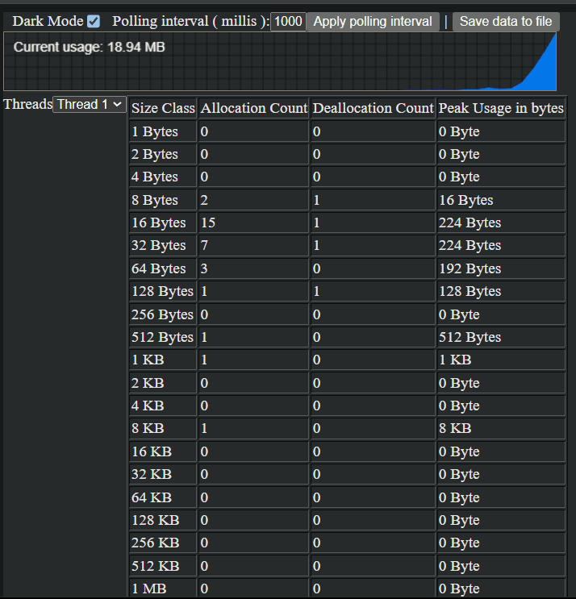
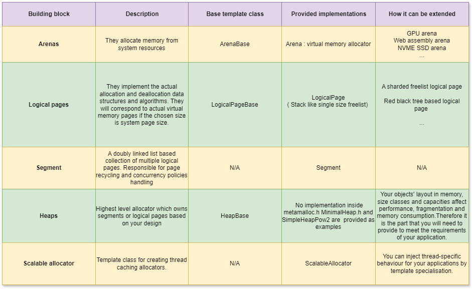

## <a name="intro"></a>**metamalloc**  

metamalloc.h is a single-header template based general purpose memory allocation library that allows you to build an allocator that is tailored for your software.

In order to build a thread caching global allocator, the only thing you need to do is provide a heap class in which you specify size classes and their capacities for your software. ( An example is provided and explained in the 'Usage & framework' section.) :


In return , that would improve CPU cache locality, reduce memory consumption and fragmentation and also improve speed since you can reduce search times and overhead of allocating virtual memory pages.

You can see benchmark numbers against the monolithic allocators IntelOneTBB, Google's tcmalloc, GNU LIB C and Microsoft's UCRT in the benchmarks section.

Note that it can also be used to develop local allocators. You can find those in the examples directory.

The repo also provides another no-dependencies single-header : memlive.h. You can use memlive as a live per-thread allocation profiler. After building your application with it, you can monitor allocations in your browser : 



- C++17

- 64bit/x64 only

- Linux and Windows , GCC and MSVC. Tested versions : GCC 11.3.0, GCC9.4.0, MSVC2022, Ubuntu22.04, Windows11

- Single header. You can browse the organised source under "include". I use a py script that I call as voltron to generate the single header. Voltron.py is under tools directory. 

- Integrations: You can include the header and call its allocation methods. Also examples for building a LD_PRELOADable shared object on Linux and statically linked DLL on Windows are provided. See the integration section below for details.

- Building examples/tests/benchmarks : Each buildable has one Makefile (make debug & make release) for Linux/GCC and one bat file for MSVC2022/Windows. ( For other MSVC versions, you can edit the bat file. )

* [Benchmarks](#benchmarks)
* [Usage & framework](#usage_and_framework)
* [Framework constraints](#framework_constraints)
* [Integration](#integration)
* [Multithreading](#multithreading)
* [Metadata](#metadata)
* [Fragmentation](#fragmentation)
* [Page recycling](#page_recycling)
* [Deallocation lookups](#deallocation_lookups)
* [Huge page usage](#huge_page)
* [Error handling & leak checking](#error_handling_and_leak_checking)
* [Memlive](#memlive)
* [Version history](#version_history)
* [Contact](#contact)

## <a name="benchmarks"></a>Benchmarks

Benchmarks use "SimpleHeapPow2" in metamalloc side which is the example heap for metamalloc. It is described in the next section.

All benchmarks use RDTSCP timestamp and CPU frequencies were maximised. They also access every single allocated byte for both write and read operations , as that is as important as allocation latency from point of a client application.

The systems used for benchmarks : 

- Linux system : Ubuntu 22.4 ,  Intel Core i7 4700HQ - 4 cores, max freq: 3.4 ghz
- Windows system : Windows11, AMD Ryzen 7 5700U - 8cores , max freq: 4.3ghz

**Single threaded local allocator benchmark :** In this Linux benchmark, applied CPU isolation and pinned threads. We allocate and deallocate various sizes :

| Allocator               | Version / Variant               |Allocations per microsecond              | Deallocations per microsecond| Total duration |
|-------------------------|:-----------------------------------:|:-----------------------:|:--------------:|:--------------:|
| GNU LibC            |     2.35                                |       15                  |         111       | 2417 microseconds |
| metamalloc      | SimpleHeapPow2 with regular 4KB vm pages                                    |           43              |      126          | 848 microseconds |
| metamalloc |   SimpleHeapPow2 with 2MB huge pages                                  |      74                   |    128            | 677 microseconds|

**Single threaded local allocator cache locality benchmark :** In this Linux benchmark , we allocate memory for members of an array of 1 million objects and then invoke '_mm_clflush' on the array. And then we access them for reads and writes. Benchmark measures LLC cache misses and duration only for the part that it accesses the array :

| Allocator               | Version / Variant               | Cache misses (LLC both read & write) | Duration |
|-------------------------|:-----------------------------------:|:-----------------------:|:--------------:|
| GNU LibC            |     2.35                                |    3.735.728                     |    15262 microseconds            |
| metamalloc      | SimpleHeapPow2                                    |       2.358,243                  |  10810 microseconds              |

**Multithreaded thread-caching global allocator benchmark :** Global allocator benchmarks are done via LD_PRELOAD'ed shared objects on Linux and via statically linked DLLs on Windows.

( The Linux shared objects require GNU LIB C 2.35 runtime as they are built on Ubuntu22.4 . If you are using a different one, the zip file also contains a text file with steps to build tcmalloc,IntelOneTBB and metamalloc shared objects. )

In this benchmark, each thread is making 407100 allocations and cross-thread deallocations. So in total each executable makes about 1.6 million allocations and cross-thread deallocations. They also do reads and writes on the allocated buffers :

| Allocator               | Version / Variant               | P90 Duration for 4 threads |
|-------------------------|:-----------------------------------:|:-----------------------:|
| GNU LibC            |     2.35                                |         86696 microseconds                |                 
| tcmalloc            |   2.9.1-0ubuntu3                                  |       52708 microseconds                  |      
| IntelOneTBB            |   oneTBB 2021.11.0                                  |   43852 microseconds                    |                    
| metamalloc     |      SimpleHeapPow2                               |               42162 microseconds          |      

As for 8 core Windows system via DLLs and with 8 threads , each executable makes 3.2 million allocations and cross-thread deallocations. ( This benchmark will work for only the latest MS CRT which is UCRT as metamalloc DLL injects trampolines to only ucrtbase.dll ) :

| Allocator               | Version / Variant               | P90 Duration for 8 threads |
|-------------------------|:-----------------------------------:|:-----------------------:|
| IntelOneTBB            |   oneTBB 2021.11.0                                  |  178805 microseconds                       |         
| MS UCRT            |     Tied to Windows version : 10.0.22621                                |                  174561 microseconds       |               
| metamalloc     |      SimpleHeapPow2                               |                73945 microseconds         |                          

**Multithreaded thread-caching global allocator memory consumption benchmark :** Sometimes you don't need the fastest allocator but the lightest one. In this one on Linux , each executable making 32 million allocation and deallocations. After completion, we look at virtual memory consumption ( /proc/self/status VMSize ). Note that a much slower configuration applied to SimpleHeapPow2 as the sole purpose here is to show its flexibility when shrinking is needed :

| Allocator               | Version / Variant               | Virtual memory usage |
|-------------------------|:-----------------------------------:|:-----------------------:|
| GNU LibC            |     2.35                                |         1.09 GB                |                          
| IntelOneTBB            |   oneTBB 2021.11.0                                  |  286 MB                       |     
| tcmalloc            |  2.9.1-0ubuntu3                                  |  256 MB                      |                           
| metamalloc     |      SimpleHeapPow2                               |                    95 MB     |      

## <a name="usage_and_framework"></a>Usage and framework

You can find the example heap "simple_heap_pow2.h" in the examples directory.

Once a heap class is ready, to build a thread caching global allocator : 

```cpp
#include <metamalloc.h>
#include <simple_heap_pow2.h>
using namespace metamalloc;

using CentralHeapType = SimpleHeapPow2<ConcurrencyPolicy::CENTRAL>;
using LocalHeapType   = SimpleHeapPow2<ConcurrencyPolicy::THREAD_LOCAL>;

using AllocatorType = ScalableAllocator<CentralHeapType, LocalHeapType>;

// To allocate : AllocatorType::get_instance().allocate(size)
// For an aligned allocation : AllocatorType::get_instance().allocate_aligned(size, alignment)
// To deallocate : AllocatorType::get_instance().deallocate(ptr);  

```

As for thread caching, that is the most common model as it is scalable and has minimised lock contention ( explained more in detail in the multithreading section ). 
You will have heaps per thread via thread local storage mechanism. If thread local heaps exhaust, then allocations will failover to the central heap.

Check "thread caching global allocator" example in the examples directory to debug the above one. Note that you can also specialise ScalableAllocator template methods to inject thread specific behaviour. For that one, see the multithreading section.

The above example uses SimpleHeapPow2 which is provided as an example heap. You can find it in the examples directory.

SimpleHeapPow2 segregates memory into power-of-two size classes to distribute the pressure. You can see the pseudocode of how it works below :
   
```plaintext

// A logical page is a basically a freelist. 
// A segment is a doubly linked list of logical pages/freelists.
// This example heap is made of 12 segments each handling one size class
Segment bins[12] // 12 = 16 32 64 128 256 512 1024 2048 4096 8192 16384 32768

allocation 
        Adjust size to the closest greater size class // For ex : 20 becomes 32 , 100 becomes 128 etc
        Allocate from adjusted size's size class bin

deallocation
        Find size class // The framework does that part by applying bitwise mask on the address, which is equivalent of modulo'ing logical page size
        Deallocate from the found size class's bin

```

As the name suggests , SimpleHeapPow2 has no further segregations. But you can create as many segregations as you need for your application , for ex: large objects, very large objects, long living objects, short living objects etc.

In case you want to use your heap for single threaded local allocations for critical parts of your software, you can do it by specialising with ConcurrencyPolicy::SINGLE_THREAD :

```cpp
using ArenaType = Arena<LockPolicy::NO_LOCK>;
using HeapType = SimpleHeapPow2<ConcurrencyPolicy::SINGLE_THREAD, ArenaType>;
```
To debug that example, check "local singlethreaded allocator" from the examples directory.

Here is an overview of the building blocks : 



## <a name="framework_constraints"></a>Framework constraints

1. Minimum allocation alignment guarantee : The framework does not guarantee 16 byte (SSE4.2) alignment for all kinds of allocations by default. In order to achieve it :

- Your minimum size class should not be less than 16 bytes
- You use only power of two size classes.

2. Contigious memory in thread local heaps : Scalable allocator's deallocate method first tries to find out which heap the pointer belongs to. In the current search method, it assumes each thread local heap has contigious memory. 
That way framework avoids allocating extra memory for tracking every allocated pointer.

## <a name="integration"></a>Integration

The easiest way to integrate is including the library and your heap class and building your application with them. You can find "integration - as a library" example in the examples directory. Note that this method won't intercept the memory allocation functions except operator new/delete in shared objects/DLLs loaded by your process.

There are also "integration - linux so ld_preload" and "integration - windows statically linked dll" examples in the examples directory. Unlike previous method, you will be able to intercept and handle memory functions in other shared objects/DLLs loaded by your process :

- On the Linux side if you use a shared object, you won't need to rebuild or relink your application. You will only need to use LD_PRELOAD when starting your application. In tests, I was able to LD_PRELOAD Python, GDB and various bash utilities with metamalloc simpleheappow2 shared object on Ubuntu22.04.
- On the Windows side, there is no equivalent of LD_PRELOAD. You will need to link your application against the DLL. The example DLL uses trampolines to replace CRT memory functions in runtime as LD_PRELOAD is absent. Also the Windows DLL example only intercepts UCRT (ucrtbase.dll). If you are targeting a different CRT version or multiple CRTs, you will need to modify the DLL code.

Note that the examples only cover only the most fundamental memory allocation functions (malloc, free, calloc, realloc, aligned_alloc, '_aligned_malloc', '_aligned_free', malloc_usable_size, '_msize') and all 20 variants of operator new/delete that exist in GNU LibC and MS UCRT binaries. Therefore if your application is using more, you may need to add missing redirections.

## <a name="multithreading"></a>Multithreading

There are 3 concurrency policies that applies to heaps and segments. The mentioned locks below are CAS operations :

- Thread-local policy : Deallocations targeting a thread local heap will submit pointers to a thread safe queue and quit immediately. Allocations on thread local heaps will deallocate by checking the queue and returning a pointer from there if possible. Deferred deallocations help us here to minimise the contention as deallocations can come from different threads, but allocations will always come from one thread.
- Central policy : There will be segment level locking.
- Single thread policy : No locks at all.

As for Arena class, it is locked by default to protect its cache. However in case of single threaded use, you can disable its locking by specialising with 'LockPolicy::NO_LOCK'. 

Injecting thread specific behaviour : A common issue with thread caching allocators is that , they all use unique size classes. If a specific thread is allocating only few size classes, the unused ones are actually wasted.
In this case, you can add thread-specific behaviour in your application's source as below :

```cpp
...
uint64_t special_thread_id = 0;
Arena<> special_thread_arena;
SpecialHeapType special_thread_heap;

template<>
LocalHeapType* ScalableAllocatorType::get_thread_local_heap()
{
    // No syscalls will get invoked below , we are identifying thread through FS/GS register
    auto tls_id = ThreadLocalStorage::get_thread_local_storage_id();

    if (tls_id == special_thread_id)
    {
        return &special_thread_heap;
    }

    return AllocatorType::get_thread_local_heap_internal();
}
...
```

To debug that example , check "injecting thread specific behaviour" example from the examples directory.

Thread exit handling : Another common problem in thread caching allocators is exits of short living threads. When they exit, their unused memory may be a problem. ScalableAllocator class will automatically transfer unused memory of exiting threads to the central heap.
 
## <a name="metadata"></a>Metadata

- Logical page headers : All logical pages use a 64 byte header.
- Allocation headers   : class LogicalPage doesn't use allocation headers. class LogicalPageAnySize uses 16 byte allocation header for each allocation.
- ScalableAllocator : Uses a configurable amount for local heaps. The default is 128 KB. Also uses a 64 KB dictionary to store very big object pointers.
- Deallocation queues : In thread local policy, each segment uses a 64kb deallocation queue. That number is configurable.

## <a name="fragmentation"></a>Fragmentation

The fragmentation entirely depends on your use of underlying data structures and layouts you define in your heaps. As for data structures :

Same size class logical pages / LogicalPage : In case of example heap SimpleHeapPow2, most objects are using same-size-class logical pages. In that case , there won't be any fragmentation in terms of the holes / unusable memory chunks. However
another outcome of it is that if two subsequent allocation requests belong to different size classes, there will be at least 1 logical page size difference in their virtual memory address space.

## <a name="page_recycling"></a>Page recycling

Recycling means returning unused virtual memory pages back to the OS. Otherwise, overall system performance may degrade. There are currently 2 policies :

- Immediate recycling ( PageRecyclingPolicy::IMMEDIATE ) : Unused virtual memory pages will be returned to the system asap during deallocations. The release rate can be controlled with a threshold value. It is the default policy.
- Deferred recycling ( PageRecyclingPolicy::DEFERRED ) : That aims low latency applications. You need to call recycle method of your heaps when you think it is good to recycle.

Alternatively to introduce your own recycling policy, you can go with PageRecyclingPolicy::DEFERRED and implement your own. For ex: a multithreaded recycler which would periodically call your heaps' recycle methods.

## <a name="deallocation_lookups"></a>Deallocation lookups

- ScalableAllocator layer : The framework assumes all thread local heaps hold contigious memory. This allows ScalableAllocator to quickly find the owner heap.

- Heap layer : That will depend on the heap implementation. The underlying Segment implementation provides 2 ways :

1. If the logical page addresses are aligned to the logical page sizes, Segment::get_size_class_from_address can be used. It will do a fast look up which involves applying a mask to the pointer to find out size class by accessing logical page header.

2. Otherwise, Segment::owns_pointer can be used. That method will do a linear search through its logical pages to find out the ownership.

That is driven by the last template argument of Segment class "bool aligned_logical_page_addresses". In SimpleHeapPow2 :

```cpp
using Segment = Segment <concurrency_policy, LogicalPageType, 
                                    ArenaType, page_recycling_policy, true>;  //  We place logical pages at addresses aligned to logical page sizes so the last template arg is true

```

SimpleHeapPow2 uses the 1st method to find out the correct bin.

## <a name="huge_page"></a>Huge page usage

You can utilise huge pages in Arena template class specialisation. An example for a local allocator is provided in the examples directory. You can also see the local allocator benchmark to observe the difference with huge pages.

On Linux if transparent huge pages are disabled, metamalloc will use the huge page flag during mmap call. If THP is enabled, then it will use madvise.

## <a name="error_handling_and_leak_checking"></a>Error handling & leak checking

- Double frees : There are no checks against it. Therefore your application may crash/segfault. You can use address sanitizer to get rid of double frees in your application before integrating metamalloc.

- Invalid frees : That means trying to deallocate a pointer which was not allocated by metamalloc. Your application may crash/segfault in this case.

- Allocations returning nullptr : That may happen due to out of memory. Not every path of every software check allocation failures therefore this may come as a crash or even worse an odd behaviour which doesn't lead to a crash.

- Issues with LD_PRELOAD'ed shared object or intercepting DLL : First try to repro the issue with building your app by including metamalloc as a library. If you are unable to repro, then you may need to add more redirections to SO/DLL. You can use ltrace on Linux and APIMonitor on Windows to get a list of those.

- Valgrind, DrMemory and sanitizers : metamalloc doesn't use their api. Therefore in order to use them. you will need to switch to standard malloc. If you use ENABLE_DEFAULT_MALLOC before including the header , ScalableAlloctor will use the usual malloc. That way you can use Valgrind, Dr.Memory or sanitizers.

- Leak checking : If you use #define ENABLE_REPORT_LEAKS before inclusion of metamalloc.h, it will create "leaks.txt" file with the missing deallocations. You can find "leak checking" example in the examples directory.

## <a name="memlive"></a>Memlive

In order to use it :

```cpp
//#define MEMLIVE_MAX_SIZE_CLASS_COUNT 21 // 21 is the default in memlive.h so it will captures allocs up to 2^(21-1)/1 mb,  increase it if you need more
#include "memlive.h"
using namespace memlive;
...				
memlive_start(address, port_number);
```

( On Windows, make sure that memlive.h is included before windows.h inclusion. That is due to a conflict between ws2tcpip.h and windows.h. )

After that you navigate to address:port_number in your browser. You can check "memlive example" in the examples directory.

- You can adjust the max allocation size to capture by defining MEMLIVE_MAX_SIZE_CLASS_COUNT before including memlive.h. If not defined it will be defaulted to 21 which will capture allocations up to 1MB.

- In order to view total peak size, select "Total" in the left hand side drop down list. Overall peak usage will appear in the most bottom row.

- In order to minimise the load , you can change the polling interval ( Ajax polling between html/js and cpp side ) in your browser.

- It uses one reactor thread which does async IO. That thread's stats are excluded, therefore all stats you will see will belong only to your application.

- In case you want to capture stats for only a sub part of your software, you can call memlive::reset just before the start of the sub part.

- The embedded Javascript code has no external dependencies. Therefore you don't need internet connection to make it work.

## <a name="version_history"></a>Version history

- 1.0.4 : Fixed an issue with deallocations of aligned allocations, added very big object allocation support to Scalable allocator to handle sizes which are not supported by heaps and removing LogicalPageAnysize to simplify the example heap and the framework
- 1.0.3 : Fixed memlive ui issue ( It was starting sizeclasses wrongly so everything was shifted ), Memlive max capture alloc size is now configurable via a macro, added fast shutdown to ScalableAllocator
- 1.0.2 : Leak reporting will create "leaks.txt" instead of console outputting, more static asserts, ASLR disabling api
- 1.0.1 : Refactorings , no functional change
- 1.0.0 : Initial version 

## <a name="contact"></a>Contact

akin_ocal@hotmail.com